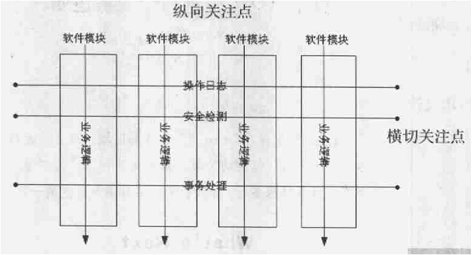

AOP(面向方面的程序设计)
================
###一个程序包括的横切面（Aspect）
> 异常和出错处理
同步和并发控制
内存访问模式
日志、安全
>事务、性能	

AOP核心内容就是所谓的“横切关注点”，即“方面”，Aspect是AOP提供的一种程序设计单元。
而在OOP中,这些一般关注点的实现单元叫作类
AOP的目标，是要将这些横切关注点与业务逻辑代码相分离，从而得到更好的软件结构、性能以及稳定性等方面的好处。 
AOP被认为是后面向对象时代的一种新的重要的程序设计技术。

###AOP的基本思想

> 通过分别描述系统的不同关注点及其关系，以一种松耦合的方式实现单个关注点，然后依靠AOP环境的支撑机制，将这些关注点组织或编排成最终的可运行程序。
> 普通关注点可以使用传统的结构化方法和面向对象方法体统的机制。
> **系统关注点**使用Aspect机制。

------------------------------------

###AOP程序设计的一般步骤
一、对需求规约进行Aspect分解。

> 确定哪些功能是组件必须实现的，即提取出核心关注点。 哪些功能可以以aspect的形式动态加入到系统组件中去，即提取出系统级的横切关注点。

二、对标识出的Aspect分别通过程序机制实现。

> 构造系统的组件。 利用组件语言实现系统的组件。对于OOP语言，这些组件可以是类；对于过程化程序设计语言，这些组件可以是各种函数和API。 
> 构造系统的aspect。 利用一种或多种aspect语言实现aspect。 aspect语言必须提供声明aspect的机制。
> aspect如何声明 连接点如何定义 aspect代码如何定义 aspect的参数化程度等

三、用aspect编织器将所有的单元编排重组在一起，形成最终的可运行系统。
（1）为组件语言和aspect语言构造相应的语法树；依据aspect中的连接点定义对语法树进行联结；在连接的语法树上生成中间文件或目标代码。
（2）aspect语言必须提供将aspect代码和基础代码组合编排（weaving）在一起的机制。
定义编排语言和规则。
解决aspect之间潜在的冲突。
为组装和执行建立外部约束。
（3）aspect语言必须提供生成可运行系统的实现机制。
系统的组合是在编译时静态组装还是运行时动态进行。
对程序单元分别进行编译的模块化编译机制。
>对组装结果的验证机制等。

------------------------
OOP（面向对象设计）
=======
##AOP与OOP比较

>OOP是AOP的技术基础，AOP是对OOP的继承和发展。
####可扩展性：
>指软件系统在需求更改时程序的易更改能力。
 OOP主要通过提供继承和重载机制来提高软件的可扩展性。
 >AOP通过扩展Aspect或增加Aspect，系统相关的各个部分都随之产生变化。

####可重用性：
> 指某个应用系统中的元素被应用到其他应用系统的能力。
 OOP以类机制作为一种抽象的数据类型，提供了比过程化更好的重用性。
OOP的重用性对非特定于系统的功能模块有很好的支持，如堆栈的操作和窗口机制的实现。
对于不能封装成类的元素，如异常处理等，很难实现重用。
>AOP使不能封装成类的元素的重用成为可能。
