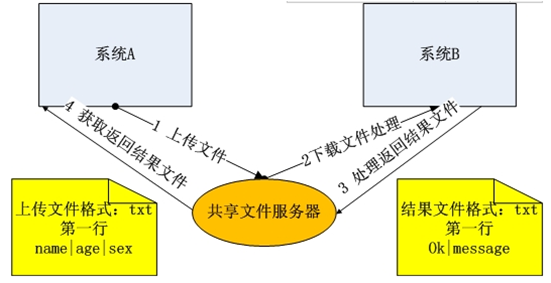

通信开发技术介绍
==========
>##SOA 
面向服务的体系结构是一个组件模型，它将应用程序的不同功能单元(称为服务)通过这些服务之间定义良好的接口和契约联系起来。接口是采用中立的方式进行定义的，它应该独立于实现服务的硬件平台、操作系统和编程语言。这使得构建在各种各样的系统中的服务可以使用一种统一和通用的方式进行交互。
>
#####通信开发技术的方式：
   1、ftp
   >对于大数据量的交互，采用这种文件的交互方式最适合不过了。系统A和系统B约定文件服务器地址，文件命名规则,文件内容格式等内容，通过上传文件到文件服务器进行数据交互。

   2、message
   >
   3、访问数据库

>消息中间件 

消息中间件利用高效可靠的消息传递机制进行平台无关的数据交流，并基于数据通信来进行分布式系统的集成。通过提供消息传递和消息排队模型，它可以在分布式环境下扩展进程间的通信。可与OA、ERP集成的免费消息中间件Active Messenger（简称AM）是一款非常实用的企业即时通讯软件。系统提供免费的消息中间件（以com组件的方式提供），开放给第三方程序使用。
>
